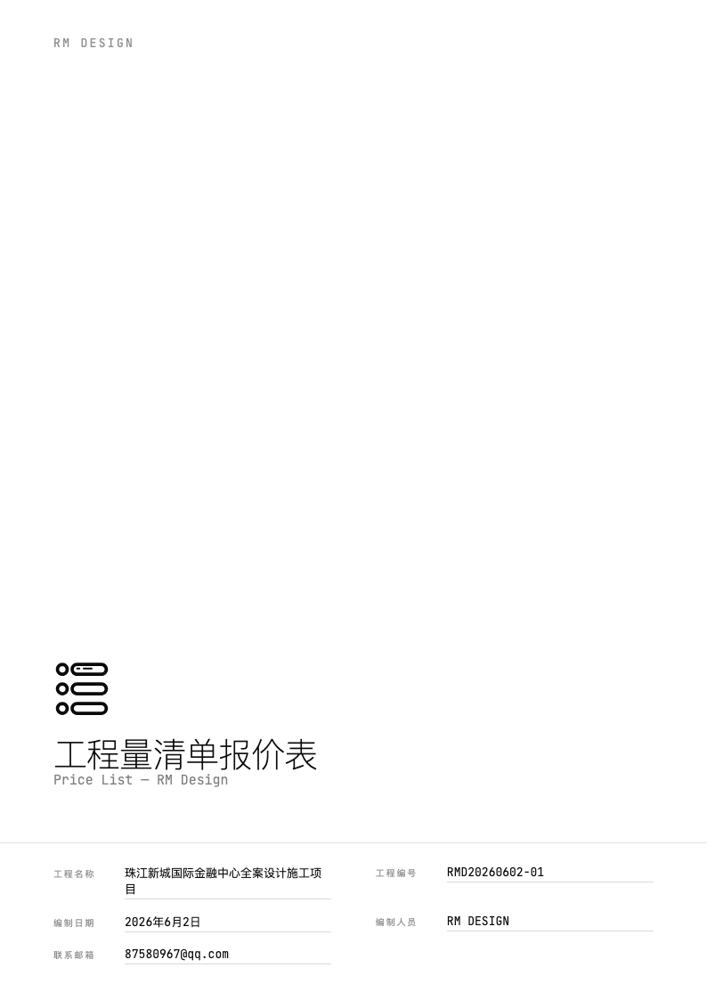



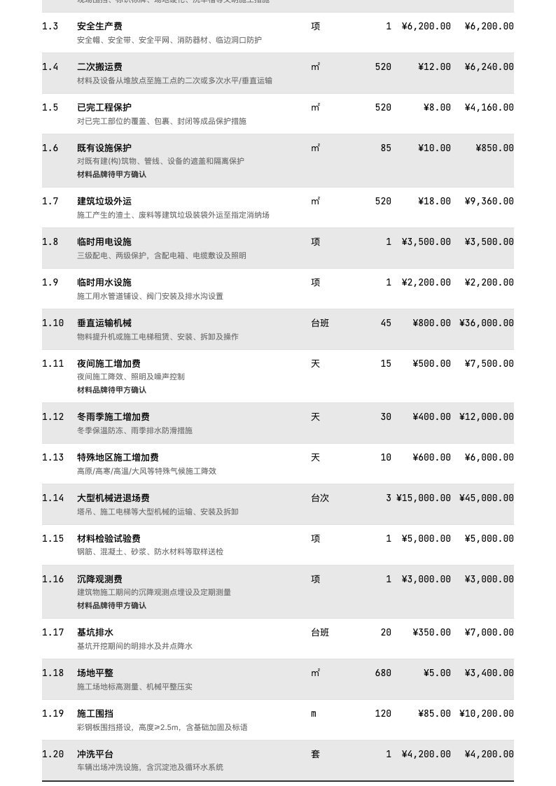

# 全案设计报价系统

从飞书多维表或 Excel 文件读取工程量清单数据，一键生成专业 PDF 报价单。支持智能填充和价格库自动积累。

## 功能特性

- **多数据源**：飞书多维表（链接直接读取）/ Excel 文件
- **4 种活跃模板**：Swiss IKB / Swiss IKB Zebra / B&W / B&W Zebra
- **智能填充**：输入分类+名称+数量，AI 自动补全项目特征、单价、备注
- **价格库**：报价自动积累，下次复用，越用越聪明
- **专业 PDF 输出**：封面 + 总价表 + 分类明细页
- **自动分页**：CSS paged media，每页自动重复标题栏和表头
- **Logo 支持**：从多维表附件读取或本地图片

## 快速开始

```bash
# 安装依赖
npm install

# 安装 Playwright 浏览器
npx playwright install chromium

# 测试渲染（默认模板）
npm test

# 指定模板渲染
node scripts/render.js --input data.json --template business-blue --vat-rate 0.08

# 测试填充（预览模式，不回写）
node scripts/fill.js --base-token <token> --detail-table-id <id> --price-table-id <id> --dry-run
```

## 命令列表

| 命令 | 功能 |
|------|------|
| `/报价 [链接]` | 读取数据 → 渲染 PDF → 可选入库 |
| `/填充 [链接]` | 查询价格库 → 自动填充项目特征/单价/备注 |
| "导入历史报价" + 文件 | 批量导入历史数据到价格库 |

## 模板风格

### 封面预览

| Swiss IKB（默认） | Swiss IKB Zebra | B&W | B&W Zebra |
|:---:|:---:|:---:|:---:|
|  |  |  |  |
| `swiss-ikb` | `swiss-ikb-zebra` | `bw` | `bw-zebra` |
| 蓝底满版 · 双语分类 | 同上 + 斑马纹 | 白底 · 黑白打印优化 | 同上 + 斑马纹 |

### 内容页预览

| Swiss IKB（默认） | Swiss IKB Zebra | B&W | B&W Zebra |
|:---:|:---:|:---:|:---:|
|  |  |  |  |
| 纯色明细行 | 白/浅蓝交替明细行 | 纯色明细行 | 白/浅灰交替明细行 |

<details>
<summary>已搁置模板（代码保留，可随时恢复）</summary>

| 模板 | 命令参数 | 配色 | 表格样式 |
|------|---------|------|---------|
| 默认 | `default` | 黑白灰 | 带边框线 |
| 商务蓝 | `business-blue` | 深蓝 | 带边框线 |
| 暖色 | `warm` | 棕色+米白 | 斑马纹 |
| 克莱因蓝 | `klein-blue` | 黑白+亮蓝强调 | 无边框 |

</details>

## 命令行参数

```
--input <json>      数据文件路径
--template <name>   模板名称（默认 default）
--vat-rate <rate>   增值税税率（默认 0.03）
--output <path>     输出路径（默认 output/<项目名称>_<工程编号>.pdf）
--test              使用内置测试数据
```

## 使用案例

### 案例 1：首次报价（无历史数据）

```
用户：/报价 https://li1fn1sw90.feishu.cn/base/XXX

AI：读取多维表数据... 共 104 条，13 个分类
    检查 Logo ✓（入目-07.png）
    税率：8%（从多维表读取）
    渲染 PDF...
    PDF 已生成：工程量报价模版项目_RMD20260531.pdf

    是否将本次 104 条数据入库价格库？

用户：是

AI：入库完成 ✓ 104 条已写入价格库
```

### 案例 2：新报价使用价格库自动填充

```
用户：在多维表中填好 3 条数据
    - 措施项目 | 脚手架 | 数量:1
    - 措施项目 | 文明施工 | 数量:1
    - 砌筑工程 | 实心砖墙(60mm) | 数量:27.4

用户：/填充 https://li1fn1sw90.feishu.cn/base/XXX

AI：读取 3 条数据，查询价格库...
    ✓ 脚手架 → 精确匹配，已填充（项目特征+单价¥3,200）
    ✓ 文明施工 → 精确匹配，已填充（项目特征+单价¥500）
    ✓ 实心砖墙(60mm) → 精确匹配，已填充（项目特征+单价¥130/㎡）

    已自动填充 3/3 条，数据已回写到多维表。
```

### 案例 3：指定模板生成报价

```
用户：/报价 https://li1fn1sw90.feishu.cn/base/XXX 用暖色模板

AI：读取数据... 104 条
    使用模板：暖色（棕色+米白底+斑马纹）
    渲染 PDF...
    PDF 已生成

    是否入库？

用户：否

AI：好的，跳过入库。
```

### 案例 4：导入历史报价到价格库

```
用户：导入历史报价 [附带 Excel 文件]

AI：解析 Excel... 提取 45 条
    标准化处理中...
    智能去重：与价格库比对
    - 新增：38 条
    - 合并更新：5 条（价格变化）
    - 完全重复：2 条（跳过）

    价格变化的条目：
    - 脚手架：¥3,200 → ¥3,500（建议更新）
    - 二次搬运：¥15 → ¥12（新价更低）

    确认导入？

用户：确认

AI：导入完成 ✓ 38 条新增，5 条更新
```

## 数据格式

```json
{
  "项目名称": "项目名称",
  "工程编号": "RMD20260531",
  "编制日期": "2026年5月31日",
  "编制人员": "RM DESIGN",
  "联系邮箱": "email@example.com",
  "logo_url": "data:image/png;base64,...",
  "items": [
    {
      "序号": "1.1",
      "工程分类": "措施项目",
      "项目名称": "脚手架",
      "项目特征": "室内脚手架",
      "备注": "",
      "单位": "项",
      "数量": 1,
      "综合单价": 3200,
      "合价": 3200
    }
  ]
}
```

## 价格库

价格库存储在飞书多维表中，字段包括：

| 字段 | 类型 | 说明 |
|------|------|------|
| 工程分类 | 单选 | 13 类标准分类 |
| 项目名称 | 文本 | 用于匹配 |
| 项目特征 | 文本 | 默认特征描述 |
| 单位 | 单选 | ㎡/项/m/套 等 |
| 综合单价 | 货币 | 历史价格 |
| 备注 | 文本 | 默认备注 |
| 最后使用日期 | 日期 | 最近引用时间 |
| 使用次数 | 数字 | 累计引用次数 |
| 来源 | 单选 | 历史导入/手动添加/报价自动入库 |

### 自动填充流程

```
用户填：分类 + 名称 + 数量
    ↓ /填充
AI 查询价格库
    ↓
精确匹配 → 自动填充
模糊匹配 → 列出候选让用户选择
无匹配 → 跳过，需手动填写
    ↓
回写多维表（项目特征 + 综合单价 + 备注 + 合价）
```

### 入库流程

```
/报价 → 渲染 PDF → 询问用户"是否入库？"
    ↓ 用户确认
批量写入价格库（数据来自读取阶段，不从 PDF 解析）
```

## 项目结构

```
quote-generator-skill/
├── scripts/
│   ├── render.js              # 核心渲染脚本（HTML → PDF）
│   └── fill.js                # 价格库智能填充脚本
├── references/
│   ├── templates/
│   │   ├── default.html       # Handlebars PDF 模板（内容页）
│   │   ├── cover-screen.html  # Swiss IKB 封面独立模板
│   │   ├── cover-bw.html      # B&W 黑白打印封面模板
│   │   ├── default.json       # 默认风格配置
│   │   ├── business-blue.json # 商务蓝配置
│   │   ├── warm.json          # 暖色配置
│   │   ├── klein-blue.json    # 克莱因蓝配置
│   │   ├── swiss-ikb.json     # Swiss IKB 配置
│   │   └── bw.json            # B&W 黑白打印配置
│   ├── helpers.js             # Handlebars 自定义 helper
│   ├── price-library.js       # 匹配引擎 + lark-cli 封装
│   └── bitable-config.json    # 飞书多维表配置
├── docs/plans/                # 设计文档
├── output/                    # PDF 输出目录
├── package.json
└── README.md
```

## 技术栈

- **Node.js (ESM)** + **Handlebars** 模板引擎
- **Playwright** + Chromium 无头浏览器渲染 PDF
- **pdf-lib** 封面/内容分离渲染后合并
- CSS paged media（自动分页、页眉重复、页码）

## 飞书集成

### 多维表读取

```bash
# 列出表
lark-cli base +table-list --base-token <token>

# 读取数据
lark-cli base +record-list --base-token <token> --table-id <table_id> --format json --limit 200
```

### Logo 下载（多维表附件）

```bash
# drive +download 不支持多维表附件，需用 media API
lark-cli api GET /open-apis/drive/v1/medias/{file_token}/download --output ./logo.png
```

### 价格库批量写入

```bash
lark-cli base +record-batch-create --base-token <token> --table-id <table_id> --json '{
  "fields": ["工程分类", "项目名称", "项目特征", "单位", "综合单价", "使用次数", "来源"],
  "rows": [
    [["措施项目"], "脚手架", "室内脚手架", ["项"], 3200, 1, ["报价自动入库"]]
  ]
}'
```

## 工程分类

支持 13 类（可在多维表中扩展）：

措施项目、拆除工程、砌筑工程、混凝土及钢筋混凝土工程、金属结构工程、防水工程、保温隔热工程、楼地面装饰工程、墙柱面装饰与隔断工程、天棚工程、油漆涂料工程、其他装饰工程、安装工程

## License

MIT
