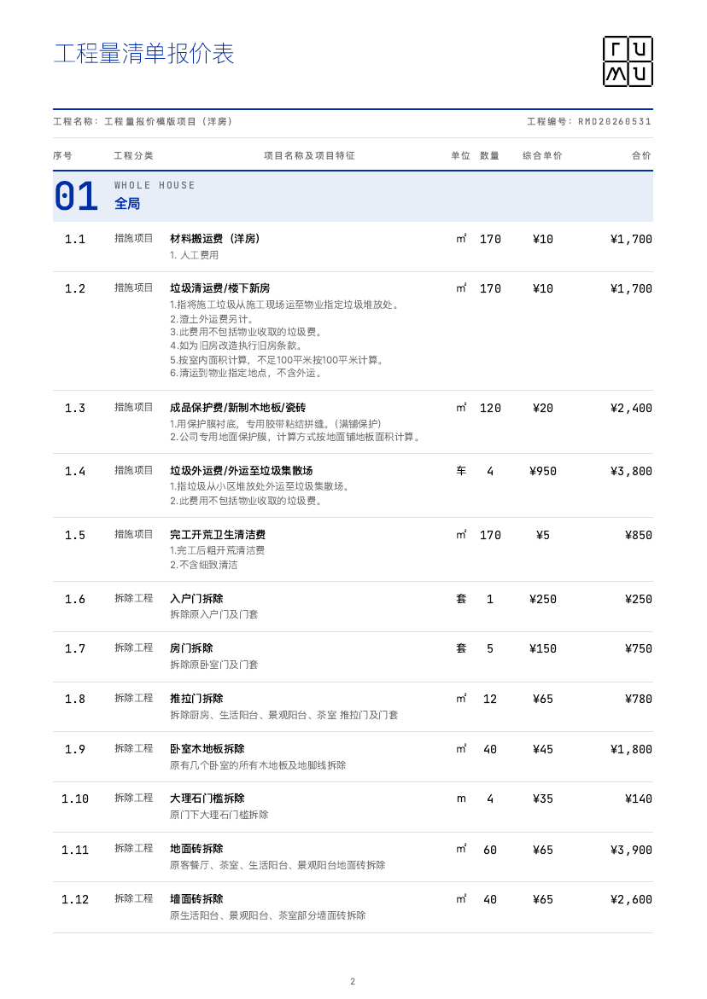

# 室内报价系统 Skill

飞书填完工程量清单，对 AI 说 `/报价`，直接出封面 + 总价 + 明细的 PDF。

MIT 开源，不卖钱。一个室内设计师自制的报价 skill。

<p align="center">
  
  
</p>

**流程：** 复制飞书模板 → 填清单 → `/报价` → PDF

---

## 它做什么

- 从飞书多维表（或 Excel）读工程量清单，生成专业 PDF
- 可按**区域**（玄关、客厅、主卧…）或按**工程分类**出表
- 管理费、增值税、序号自动算，飞书里不用维护序号列
- 4 套模板：Swiss IKB / Zebra，以及适合打印的黑白版

需要 Node.js 18+，目前主要支持 macOS / Linux。

---

## 快速开始

### 1. 安装

```bash
git clone https://github.com/pharder56k/quote-generator-skill.git
cd quote-generator-skill
bash setup.sh
```

脚本会装依赖、Playwright，并检查 `lark-cli`。装完可先离线看效果：

```bash
npm run demo
```

PDF 会出现在 `output/`。

### 2. 复制飞书模板

每个新项目复制一份：[打开项目模板](https://li1fn1sw90.feishu.cn/base/LfjJbLrTHacijesHmIjcDtSpnJf?from=from_copylink)

模板里有两张表：

- **项目信息**：名称、工程编号、税率、管理费、Logo
- **报价明细**：区域、工程分类、名称、特征、单位、数量、综合单价（不用填序号）

复制后把新表链接发给 Agent 即可。飞书需先登录：

```bash
lark-cli auth login
```

### 3. 出报价单

```
/报价 https://xxx.feishu.cn/base/你的多维表
```

Agent 会读表、让你选分类方式和模板，然后出 PDF。

```
你：/报价 https://xxx.feishu.cn/base/ABC123

AI：读到 59 条。按区域分，还是按工程分类？
你：按区域
AI：Swiss IKB · 税率 8% · 管理费 10%
    PDF 已生成。
```

---

## 模板

默认 **Swiss IKB**。出报价前可选。

| Swiss IKB | Swiss IKB Zebra | B&W | B&W Zebra |
|:---:|:---:|:---:|:---:|
|  |  |  |  |
| 蓝底满版 | 蓝底 + 斑马纹 | 白底，适合打印 | 白底 + 斑马纹 |

明细页：

| Swiss IKB | Swiss IKB Zebra | B&W | B&W Zebra |
|:---:|:---:|:---:|:---:|
|  |  |  |  |

按区域出表时，分组标题是中英对照（如 `02 FOYER 玄关`），英文名由 Agent 每次按项目翻译。

<p align="center">
  
</p>

---

## 反馈

用过请直接开 [Issue](https://github.com/pharder56k/quote-generator-skill/issues) 或 [Discussion](https://github.com/pharder56k/quote-generator-skill/discussions)。尤其想听：

1. 你出报价更习惯按房间，还是按工程分类？
2. 管理费 / 增值税这么算对不对？
3. 哪一页看起来不专业？
4. 安装卡在哪一步？

截图、真实项目结构、改不动的报错，都比「挺好看」有用。

---

<details>
<summary>安装排障</summary>

| 问题 | 处理 |
|---|---|
| `command not found: node` | 安装 [Node.js](https://nodejs.org) >= 18，重开终端 |
| `Executable doesn't exist` | 在项目目录执行 `npx playwright install chromium` |
| `command not found: lark-cli` | macOS：`brew install lark-cli`，再重开终端 |
| lark-cli 认证错误 | `lark-cli auth login` |
| 中文乱码 | 字体已内嵌 WOFF2，一般不用管 |

手动安装（不用 `setup.sh` 时）：

```bash
npm install
npx playwright install chromium
brew install lark-cli   # macOS
lark-cli auth login
```

</details>

<details>
<summary>CLI、税费、分类规则</summary>

离线渲染，不走飞书：

```bash
node scripts/render.js \
  --input test-data/template-demo.json \
  --template swiss-ikb \
  --group-by area \
  --output output/示例.pdf
```

- `--group-by area` 按区域；`category` 按工程分类（默认）
- `--vat-rate` 可覆盖数据里的税率；不传则读 `税率`，默认 3%
- `管理费` 按工程总价计；增值税 = (总价 + 管理费) × 税率
- 费率兼容 `0.08` 和 `8`
- 金额渲染为整数；组内顺序 = 飞书记录顺序（拖拽即可改）

工程分类模式的序号前缀按这 13 类：措施、拆除、泥瓦、混凝土及钢筋混凝土、金属结构、防水、保温隔热、楼地面装饰、墙柱面装饰与隔断、木作、腻子、其他装饰、水电安装。自定义分类排在后面。

JSON 结构和 Agent 工作流见 [`SKILL.md`](SKILL.md)。

</details>

---

## License

[MIT](LICENSE)。可以自由使用、修改、分发，包括商用；保留版权和许可声明即可。
