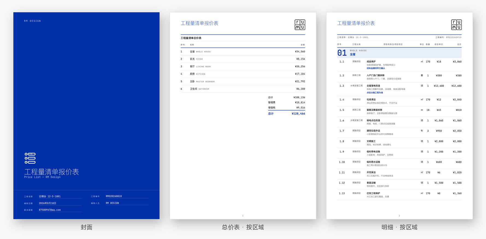
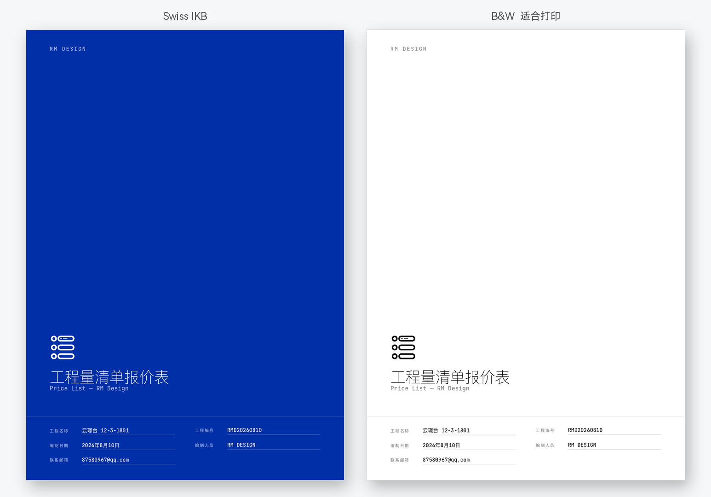
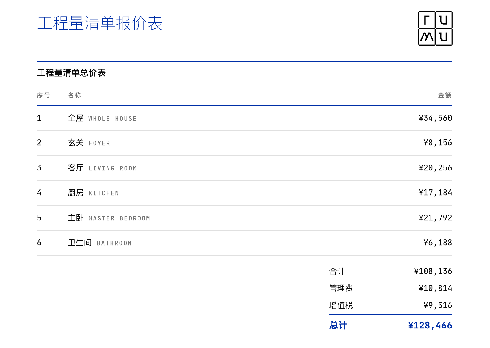
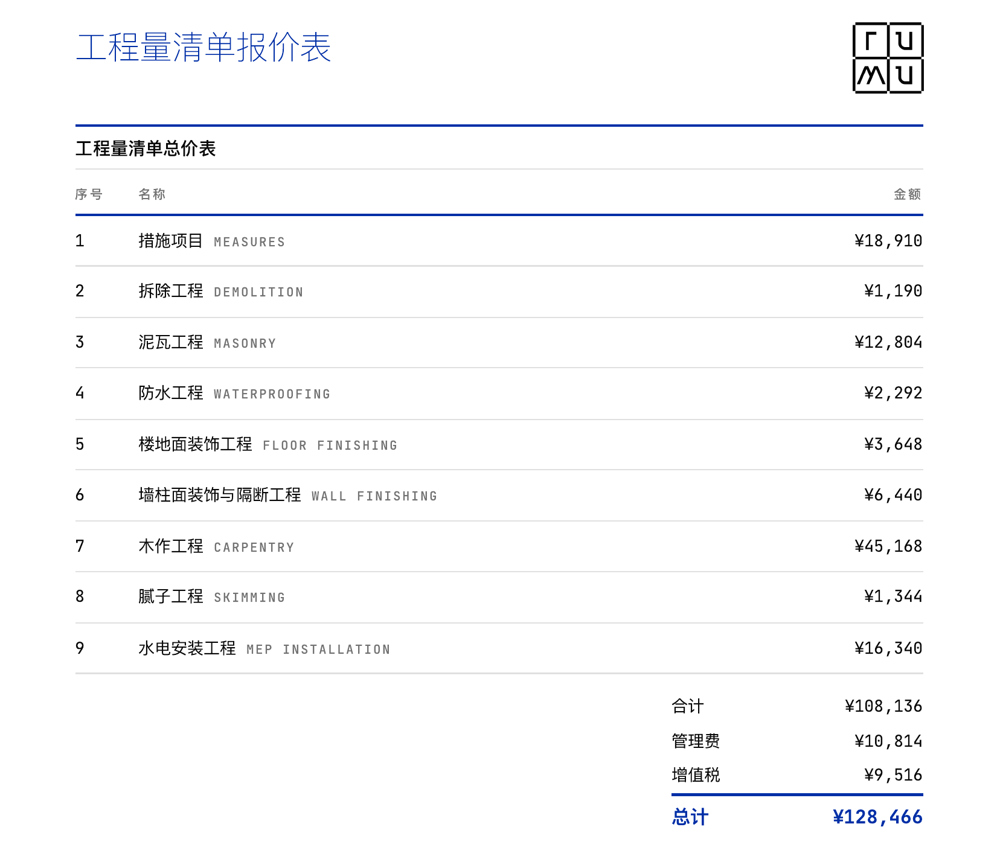
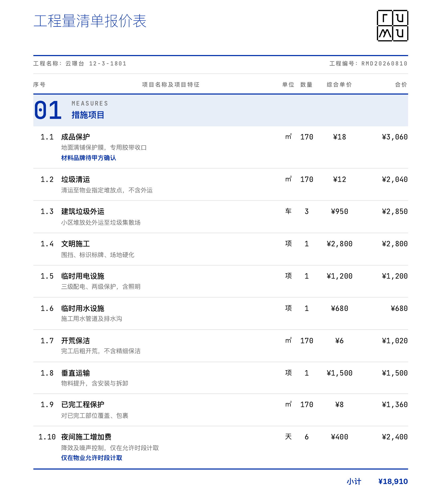
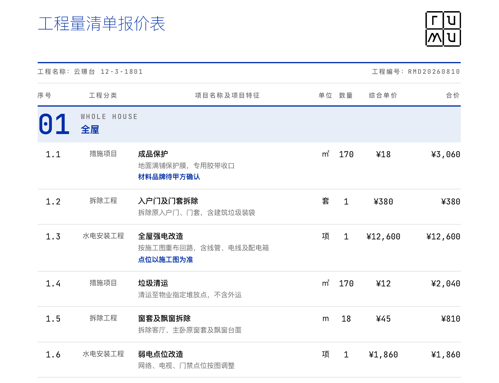
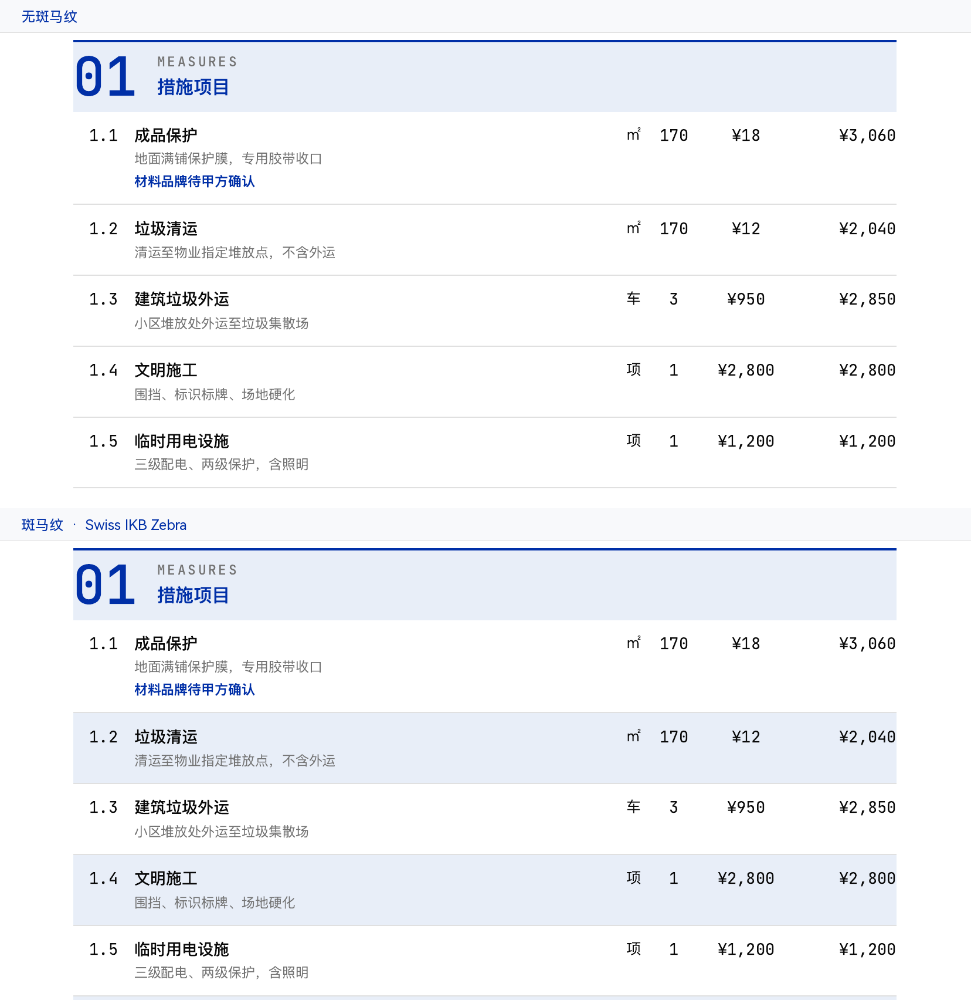

# quote-generator-skill · 室内设计报价系统

<p align="center">
  <strong>告别排版混乱的 Excel。飞书填完工程量清单，对 AI 说一句 <code>/报价</code>，直接出一份可以交给业主的 PDF。</strong>
</p>

<p align="center">
  
  
  
  
</p>


https://github.com/user-attachments/assets/bb92275e-7bac-4fb2-9148-ddcdba06b775


<p align="center">
  
</p>

上面是同一份示例数据渲出来的三页，不是效果图。

---

## 为什么做这个

大多数室内设计师出报价时，都遇到过这些事：

- **排版费时**：调格式要两小时，改一个单价，打印区域和分页又得重来。
- **拿出去不好看**：效果图画完了，交给甲方的却是一张满屏网格、字体发虚的 Excel。
- **公式容易错**：序号改漏、管理费和税率算错层级、跨区域求和断行。
- **发出去就乱**：电脑上改完发微信，手机里预览格式全变了。

这个 skill 是一个室内设计师写来自用的。清单继续在飞书多维表格里填，排版、序号、管理费、增值税、中英对照和 PDF，交给程序和 AI。

---

## 它做什么

- **瑞士风格版式**：默认封面是国际克莱因蓝（Swiss IKB）。另外有斑马纹，以及适合黑白打印的白底版。一共 4 套，出单前选。
- **总价和分组标题中英对照**：按房间（玄关、客厅、主卧）或按工程分类，名称都是中文后面接英文。常见分类有内置英文；区域名和自定义分类由 Agent 当次翻译，不套用上一份项目。
- **数字不用手维护**：序号按分组自动生成，合价按数量 × 综合单价核对。管理费按工程总价计，增值税按「总价 + 管理费」计。飞书里拖拽行，导出顺序跟着变。
- **两种用法**：对 Agent 说 `/报价` 加多维表链接；或者不连飞书，用本地 JSON 一条命令渲染。

---

## 版式

生成前可选。斑马纹不改封面，只给明细行加浅底。

| 模板 | 看起来怎样 | 适合 |
| --- | --- | --- |
| Swiss IKB | 蓝底满版封面，内页蓝线网格 | 屏幕上看、提案、发给业主 |
| Swiss IKB Zebra | 封面同上，明细行白 / 浅蓝交替 | 条目多，核对时不容易串行 |
| B&W | 白底封面，浅灰强调 | 黑白打印、现场交底、归档 |
| B&W Zebra | 白底封面，明细行白 / 浅灰交替 | 要打印，又要长清单好读 |

<p align="center">
  
</p>

总价表无论按区域还是按工程分类，都是中文后面接英文。底下是合计、管理费、增值税、总计。管理费为 0 时不显示这一行。





明细的分组标题是大号序号、英文、中文。名称下面是项目特征，备注用蓝色，组末有小计。按区域出表时，序号后面多一列工程分类。







---

## 3 分钟开始

需要 Node.js 18+，目前主要在 macOS / Linux 上用。

### 1. 安装

```bash
git clone https://github.com/pharder56k/quote-generator-skill.git
cd quote-generator-skill
bash setup.sh
```

脚本会装依赖、Playwright，并检查 `lark-cli`。先离线看效果：

```bash
npm run demo
```

PDF 在 `output/`。

### 2. 复制飞书模板

每个新项目复制一份：[打开项目模板](https://li1fn1sw90.feishu.cn/base/LfjJbLrTHacijesHmIjcDtSpnJf?from=from_copylink)

两张表：

- **项目信息**：项目名称、工程编号、编制日期、编制人员、联系邮箱、税率、管理费、Logo
- **报价明细**：区域、工程分类、项目名称、项目特征、单位、数量、综合单价（不用填序号）

然后登录飞书：

```bash
lark-cli auth login
```

已有 Excel 时，先导入这张多维表再出单。字段和行顺序比直接解析 Excel 稳。

### 3. 出报价单

对配置了这个 Skill 的 Agent 说：

```text
你：/报价 https://xxx.feishu.cn/base/你的多维表

AI：读到 59 条。按区域，还是按工程分类？
你：按区域
AI：Swiss IKB · 税率 8% · 管理费 10%
    PDF 已生成。
```

不走 Agent，也可以直接渲染：

```bash
node scripts/render.js \
  --input test-data/readme-showcase.json \
  --template swiss-ikb \
  --group-by area \
  --output output/项目报价.pdf
```

- `--group-by area` 按区域；`category` 按工程分类（默认）
- `--template`：`swiss-ikb` / `swiss-ikb-zebra` / `bw` / `bw-zebra`
- `--vat-rate` 可覆盖表里的税率，写成 `0.08` 或 `8` 都可以。不传则读「税率」，默认 3%

---

## 分类和算法

按工程分类时，按这 13 类排序。没出现的分类不占号，自定义分类排在后面，英文由 Agent 当次写入，不留空。

措施项目 → 拆除工程 → 泥瓦工程 → 混凝土及钢筋混凝土工程 → 金属结构工程 → 防水工程 → 保温隔热工程 → 楼地面装饰工程 → 墙柱面装饰与隔断工程 → 木作工程 → 腻子工程 → 其他装饰工程 → 水电安装工程

```text
管理费 = 合计 × 管理费率
增值税 = (合计 + 管理费) × 税率
总计   = 合计 + 管理费 + 增值税
```

金额渲染为整数。序号格式是 `1.1`、`1.2`，组内顺序等于飞书视图里的拖拽顺序。

本页图片用 `test-data/readme-showcase.json` 渲染后裁切。JSON 结构和 Agent 工作流见 [`SKILL.md`](SKILL.md)。

---

## 安装排障

| 报错 | 原因 | 处理 |
| --- | --- | --- |
| `command not found: node` | 没有 Node，或版本低于 18 | 安装 [Node.js](https://nodejs.org) 18+，重开终端 |
| `Executable doesn't exist` | Playwright 的 Chromium 没装完 | 在项目目录执行 `npx playwright install chromium` |
| `command not found: lark-cli` | 没有飞书命令行 | macOS：`brew install lark-cli`，再重开终端 |
| lark-cli 认证错误 | 登录过期 | `lark-cli auth login` |
| 中文乱码 | 渲染时字体没加载上 | 字体已内嵌为 WOFF2，一般不用另装。确认没改乱 `references/fonts/` |

不用 `setup.sh` 时：

```bash
npm install
npx playwright install chromium
brew install lark-cli   # macOS
lark-cli auth login
```

---

## 反馈

一个室内设计师业余维护的开源项目。MIT，不收费。

用过请开 [Issue](https://github.com/pharder56k/quote-generator-skill/issues) 或 [Discussion](https://github.com/pharder56k/quote-generator-skill/discussions)。尤其想听：

1. 你的客户更接受按房间，还是按工程分类？
2. 管理费、增值税这么分步算，和你们公司的规则一样吗？
3. 哪一页拿去给甲方看，还是不够清楚，或不够像样？

真实项目的结构、改不动的报错、甲方看不懂的那一页，比「挺好看」有用。

---

## License

[MIT](LICENSE)。可以自由使用、修改、分发，包括商用。保留版权和许可声明即可。
