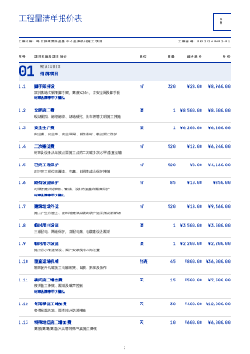
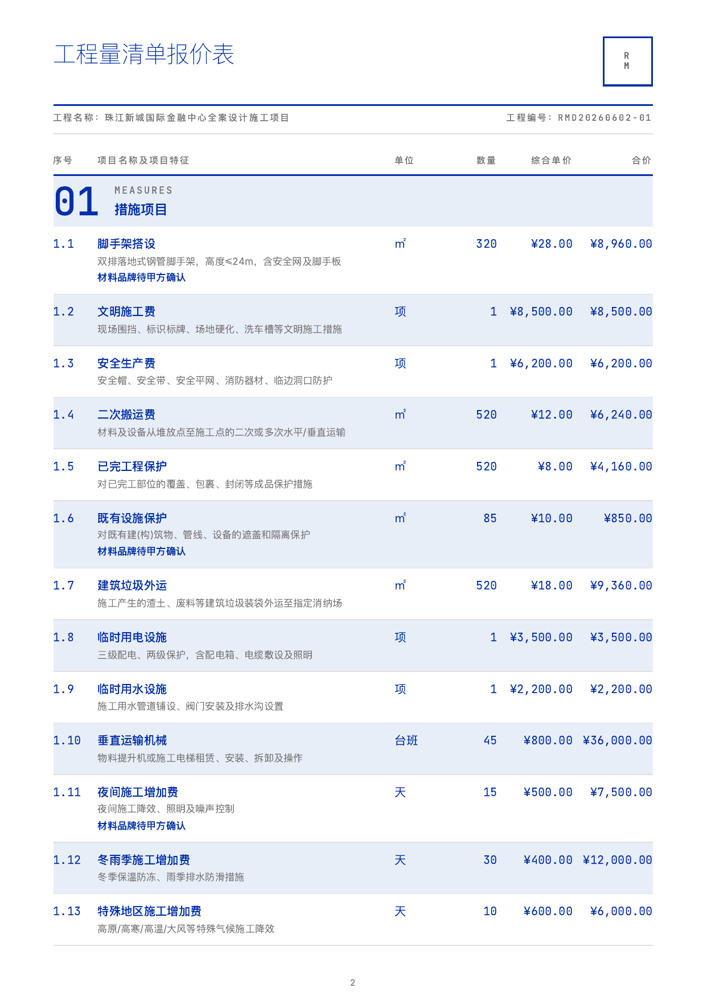
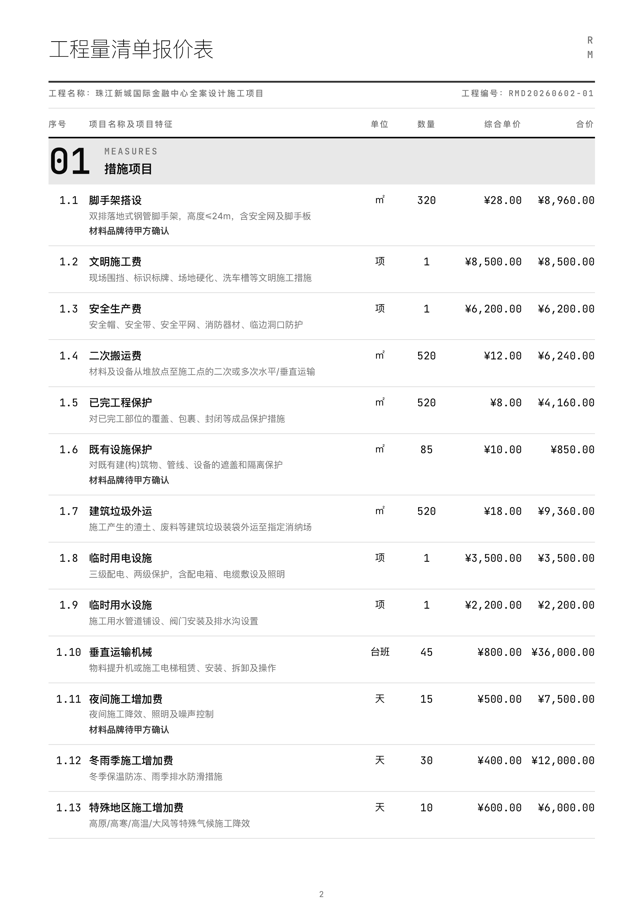
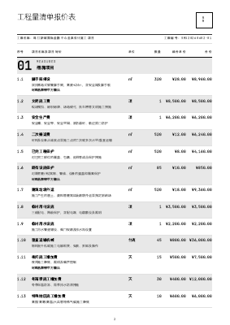

# 室内报价系统 Skill

从飞书多维表或 Excel 文件读取工程量清单数据，一键生成专业 PDF 报价单。支持智能填充和价格库自动积累。

## 功能特性

- **飞书多维表驱动**：复制模板 → 填入数据 → 对 AI 说 `/报价` → 出 PDF
- **4 种模板风格**：Swiss IKB / Swiss IKB Zebra / B&W / B&W Zebra
- **智能价格库**：`/填充` 自动匹配历史价格，越用越聪明
- **专业 PDF 输出**：封面 + 总价表 + 分类明细页，自动分页
- **Logo 支持**：自动从飞书多维表附件读取

## 安装

```bash
git clone <repo-url> quote-generator-skill
cd quote-generator-skill
bash setup.sh
```

`setup.sh` 自动完成：
- Node.js 版本检查（>= 18）
- `npm install` 依赖安装
- Playwright Chromium 浏览器安装
- lark-cli 安装检测与登录引导
- SKILL.md 路径自动配置

## 快速开始

**三步上手：**

1. **复制飞书模板** — 打开 [报价模板多维表](https://li1fn1sw90.feishu.cn/base/LfjJbLrTHacijesHmIjcDtSpnJf?from=from_copylink)，点击"复制此多维表"到你的飞书空间
2. **填入数据** — 在「项目信息」表填工程概况，在「报价明细」表填清单条目
3. **对 AI 说** — `/报价 <你的多维表链接>`

**离线体验（无需飞书）：**

```bash
npm run demo         # 用内置示例数据渲染全部 4 个模板
npm test             # 渲染单个模板（默认 Swiss IKB）
```

## 命令列表

| 命令 | 功能 |
|------|------|
| `/报价 [飞书多维表链接]` | 读取数据 → 下载 Logo → 确认模板 → 渲染 PDF |
| `/填充 [飞书多维表链接]` | 查询价格库 → 自动匹配填充项目特征/单价/备注 |
| `导入历史报价` + 文件 | 批量导入历史数据到价格库 |

## 使用示例

```
用户：/报价 https://xxx.feishu.cn/base/ABC123

AI：读取多维表数据... 共 104 条，13 个分类
    使用模板：Swiss IKB
    税率：3%
    渲染 PDF...
    PDF 已生成：测试报价模板_TEST002_swiss-ikb.pdf

    是否将本次 104 条数据入库价格库？

用户：是

AI：入库完成，104 条已写入价格库
```

## 模板风格

### 封面预览

| Swiss IKB（默认） | Swiss IKB Zebra | B&W | B&W Zebra |
|:---:|:---:|:---:|:---:|
|  |  |  |  |
| `swiss-ikb` | `swiss-ikb-zebra` | `bw` | `bw-zebra` |
| 蓝底满版 · 双语分类 | 同上 + 斑马纹 | 白底 · 黑白打印优化 | 同上 + 斑马纹 |

### 内容页预览

| Swiss IKB（默认） | Swiss IKB Zebra | B&W | B&W Zebra |
|:---:|:---:|:---:|:---:|
|  |  |  |  |
| 纯色明细行 | 白/浅蓝交替明细行 | 纯色明细行 | 白/浅灰交替明细行 |

## 项目结构

```
quote-generator-skill/
├── setup.sh                     # 一键安装脚本
├── SKILL.md                     # Skill 定义（Agent 工作流）
├── package.json
├── scripts/
│   ├── render.js                # HTML → PDF 渲染引擎
│   ├── fill.js                  # 价格库智能填充
│   ├── demo.js                  # 开箱即用演示
│   └── generate-large-test.js   # 大型测试数据生成器
├── references/
│   ├── templates/
│   │   ├── content.html         # 内容页模板（总价表 + 明细）
│   │   ├── cover-screen.html    # Swiss IKB 封面模板
│   │   ├── cover-bw.html        # B&W 封面模板
│   │   ├── swiss-ikb.json       # Swiss IKB 配置
│   │   ├── swiss-ikb-zebra.json # Swiss IKB Zebra 配置
│   │   ├── bw.json              # B&W 配置
│   │   └── bw-zebra.json        # B&W Zebra 配置
│   ├── helpers.js               # Handlebars 辅助函数
│   ├── price-library.js         # 匹配引擎 + lark-cli 封装
│   └── bitable-config.json      # 多维表模板配置
├── test-data/                   # 测试数据
├── docs/
│   ├── previews/                # 模板预览图
│   └── plans/                   # 设计文档
├── output/                      # PDF 输出目录
└── README.md
```

## 工程分类

支持 13 类（可在多维表中扩展）：

措施项目、拆除工程、砌筑工程、混凝土及钢筋混凝土工程、金属结构工程、防水工程、保温隔热工程、楼地面装饰工程、墙柱面装饰与隔断工程、天棚工程、油漆涂料工程、其他装饰工程、安装工程

## License

MIT
